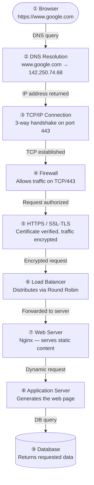

# What Happens When You Type https://www.google.com and Press Enter?

This question is a classic in software engineering interviews — and for good reason. It touches nearly every layer of the web stack. Let's walk through each step of the journey, from your keyboard to Google's servers and back.

---

## 1. DNS Request

Before your browser can connect to Google, it needs to translate the human-readable domain name `www.google.com` into an IP address that routers can understand.

Here's the resolution chain:

1. Your browser checks its **local cache** — has it visited Google recently?
2. If not, it asks your **OS**, which checks its own cache and the local `/etc/hosts` file.
3. Still no answer? The OS queries your **local DNS resolver** (usually provided by your ISP or a service like Google's `8.8.8.8`).
4. The resolver, if it doesn't have the answer cached, starts a **recursive query**:
   - It asks a **Root Name Server** → "Who handles `.com`?"
   - Then the **TLD Name Server** → "Who handles `google.com`?"
   - Finally, Google's **Authoritative Name Server** → "What's the IP of `www.google.com`?"
5. The resolver returns the IP address (e.g., `142.250.74.68`) to your browser and caches it for future use.

---

## 2. TCP/IP — Establishing the Connection

With the IP address in hand, your browser needs to establish a connection to Google's server. It does this using the **TCP/IP protocol stack**.

- TCP (Transmission Control Protocol) ensures reliable, ordered delivery of data.
- The connection begins with a **3-way handshake**:
  1. Your browser sends a **SYN** packet to the server.
  2. The server responds with a **SYN-ACK**.
  3. Your browser confirms with an **ACK**.

The connection is now established on **port 443** (the default port for HTTPS).

---

## 3. Firewall

Before traffic reaches Google's infrastructure, it passes through multiple **firewalls** — both on your local network and on Google's side.

Firewalls inspect packets and decide whether to allow or block them based on rules. Google's firewalls:
- Accept inbound traffic on **port 443** (HTTPS)
- Block suspicious or malformed requests
- Protect against DDoS attacks and unauthorized access

---

## 4. HTTPS / SSL — Encrypting the Traffic

Since the URL starts with `https://`, the browser initiates a **TLS handshake** (Transport Layer Security, the modern successor to SSL) after the TCP connection is established.

This process:
1. The server sends its **SSL/TLS certificate**, proving it is indeed `www.google.com` (signed by a trusted Certificate Authority).
2. Browser and server **negotiate a cipher suite** (encryption algorithm).
3. They exchange keys and establish a **shared secret** for symmetric encryption.
4. All subsequent communication is **encrypted** — no one in the middle can read your data.

This ensures **confidentiality** (data is private), **integrity** (data isn't tampered with), and **authentication** (you're really talking to Google).

---

## 5. Load Balancer

Google receives millions of requests per second. No single server could handle that. So your request first hits a **load balancer**.

The load balancer:
- Receives your HTTPS request
- Decides which backend server should handle it, using algorithms like **Round Robin**, **Least Connections**, or **IP Hash**
- Forwards the request to the chosen server
- Also handles **health checks** to avoid sending traffic to servers that are down

Google uses its own globally distributed load balancing infrastructure, routing your request to the nearest and least-loaded data center.

---

## 6. Web Server

Your request arrives at a **web server** (Google uses custom-built web servers, but common ones include Nginx or Apache).

The web server:
- Handles the **HTTP protocol** layer
- Serves **static content** (HTML, CSS, JS, images) directly if available
- Forwards **dynamic requests** to the application server

---

## 7. Application Server

For dynamic content — like personalized search results — the web server forwards the request to an **application server**.

The application server:
- Executes the **business logic** of the application
- Processes your search query
- Determines what results to return
- Communicates with the database to fetch data
- Assembles the final **HTML response**

---

## 8. Database

The application server queries a **database** to retrieve relevant data — in Google's case, the search index, user preferences, ad data, and more.

Google uses a variety of proprietary storage systems (like **Bigtable** and **Spanner**), but the principle applies to any web app:
- The app server sends a **query** (e.g., "give me the top 10 results for 'cats'")
- The database returns the **data**
- The app server uses it to build the response

---

## Putting It All Together

Every time you press Enter, this entire chain — DNS, TCP, TLS, firewall, load balancing, web server, app server, database — completes in **under a second**. That's the magic of modern web infrastructure.

---

> Read this article on [Medium](https://medium.com/@f.besancon/what-happens-when-you-type-https-www-google-com-and-press-enter-2b1331830b32).
