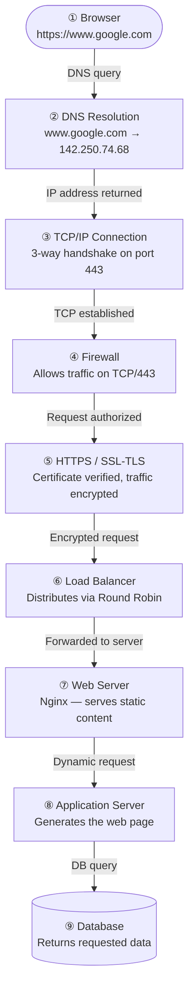

```mermaid
flowchart TD
    Browser(["① Browser\nhttps://www.google.com"])
    DNS["② DNS Resolution\nwww.google.com → 142.250.74.68"]
    TCP["③ TCP/IP Connection\n3-way handshake on port 443"]
    FW["④ Firewall\nAllows traffic on TCP/443"]
    SSL["⑤ HTTPS / SSL-TLS\nCertificate verified, traffic encrypted"]
    LB["⑥ Load Balancer\nDistributes via Round Robin"]
    WS["⑦ Web Server\nNginx — serves static content"]
    AS["⑧ Application Server\nGenerates the web page"]
    DB[("⑨ Database\nReturns requested data")]
 
    Browser -->|"DNS query"| DNS
    DNS -->|"IP address returned"| TCP
    TCP -->|"TCP established"| FW
    FW -->|"Request authorized"| SSL
    SSL -->|"Encrypted request"| LB
    LB -->|"Forwarded to server"| WS
    WS -->|"Dynamic request"| AS
    AS -->|"DB query"| DB
```
    
